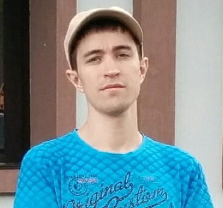

# Konstantin Polubotonov

## Contact information:
- __Location:__ Russia, Novosibirsk
- __e-mail:__ alias1322@gmail.com
- __Discord:__ Konstantin (@Alias-nsk)
- [GitHub](https://github.com/Alias-nsk)

### About me:
- I am 38 years old. Сurrently I work as a system administrator, but I always wanted to try myself as a front-end developer. I have little experience writing small programs on C++ and C#, but I never tried to do site layout.
- __My goal__ is obtaining new knowledge in the field of Front-End developing.
- __My qualities__: Responsibility, high learning ability, perseverance, hard work.

### Skills:
- HTML5, CSS3
- JavaScript (Basics)
- C++
- C#
- Git
- VSCode
- Microsoft Visual Studio 2015 - 2019

### Code Examples:
[Kata "Create Phone Number"](https://www.codewars.com/kata/525f50e3b73515a6db000b83)
```C#
public class Kata
{
  public static string CreatePhoneNumber(int[] numbers)
  {
    string number = "(" + numbers[0] + numbers[1] + numbers[2] + ") " + numbers[3] + numbers[4] + numbers[5] + '-' + 
      numbers[6] + numbers[7] + numbers[8] + numbers[9];
    return number;
  }
}
```

### Languages:
- Russian - Native speaker
- English - B1 (Intermediate)
- Japanese (Beginner)
